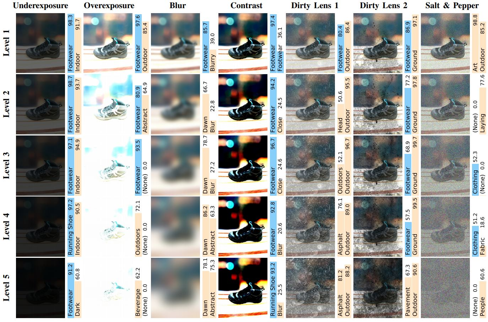
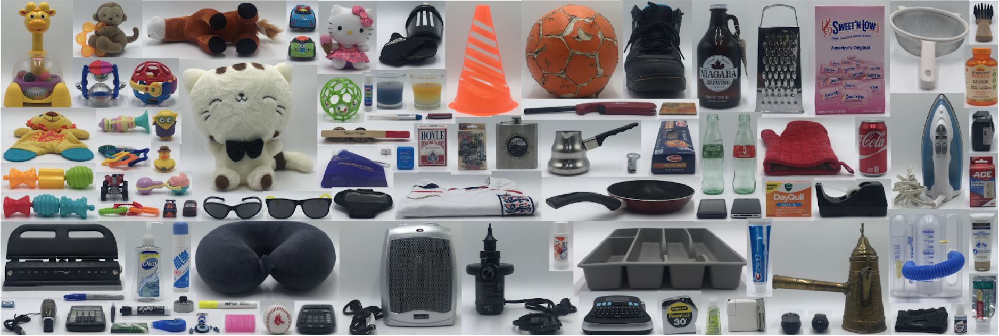
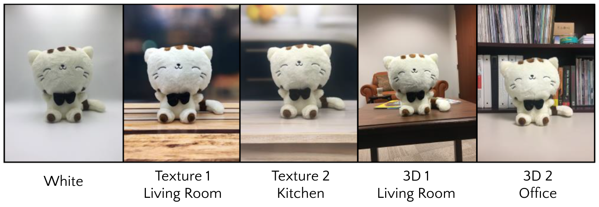
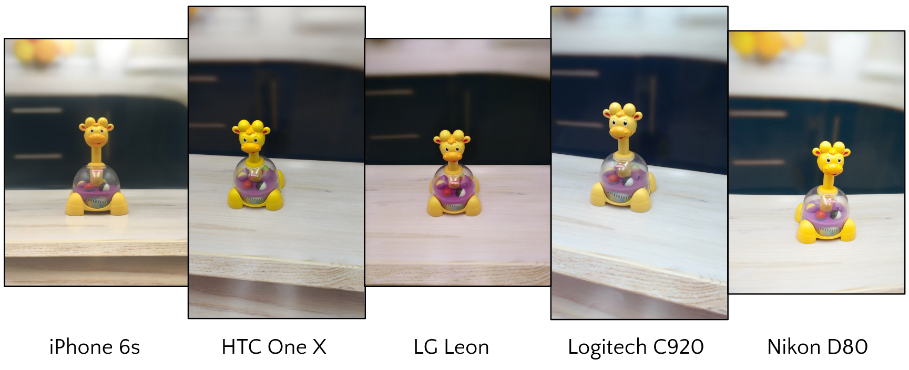
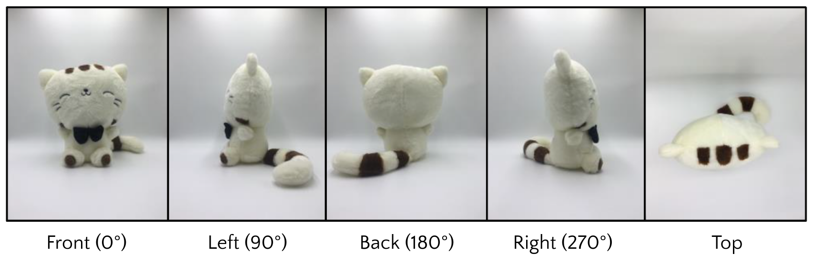

# CURE-OR

 [OLIVES Lab, Georgia Institute of Technology](https://ghassanalregib.com/)


<p align="center"></p>


The goal of this project is to analyze the robustness of off-the-shelf recognition applications under multifarious challenging conditions, investigate the relationship between the recognition performance and image quality, and estimate the performance based on hand-crafted features as well as data-driven features. To achieve this goal, we introduced a large-scale, controlled, and multi-platform object recognition dataset CURE-OR, which stands for Challenging Unreal and Real Environments for Object Recognition.  This repository summrizes the characterisitcs of our dataset and provides codes to reproduce analysis results in our papers. For more information about CURE-OR, please refer to our papers.

### Papers
If you use CURE-OR dataset and/or these codes, please cite:

 [CURE-OR: Challenging Unreal and Real Environments for Object Recognition](https://arxiv.org/pdf/1810.08293.pdf)
  
```
  @inproceedings{Temel2018_ICMLA,
author      = {D. Temel and J. Lee and G. AlRegib},
booktitle   = {2018 17th IEEE International Conference on Machine Learning and Applications (ICMLA)},
title       = {CURE-OR: Challenging unreal and real environments for object recognition},
year        = {2018},}
```
   
 [Object Recognition Under Multifarious Conditions: A Reliability Analysis and A Feature Similarity-Based Performance Estimation](https://arxiv.org/pdf/1902.06585.pdf)

```
@INPROCEEDINGS{Temel2019_ICIP,
author      = {D. Temel and J. Lee and G. AIRegib},
booktitle   = {IEEE International Conference on Image Processing (ICIP)},
title       = {Object Recognition Under Multifarious Conditions: A Reliability Analysis and A Feature Similarity-Based Performance Estimation},
year        = {2019},}
```
 
### Download Dataset
In CURE-OR dataset, there are 1,000,000 images of 100 objects with varying size, color, and texture, captured with multiple devices in different setups. The majority of images in the CURE-OR dataset were acquired with smartphones and tested with off-the-shelf applications to benchmark the recognition performance of devices and applications that are used in our daily lives. In order to receive the download link, please fill out this [form](https://goo.gl/forms/YVM3N6RrywNPuEjJ3) to submit your information and agree to the conditions to use. These information will be kept confidential and will not be released to anyone outside the OLIVES administration team. Alternatively, you may download a mini version of the CURE-OR dataset to experiment with its various features before you try download the complete version. See more details [here](https://github.com/olivesgatech/mini-CURE-OR).
  

### Dataset Characteristics
<table>
<tbody>
<tr style="text-align:justify;">
<td style="text-align:center;"><strong> Object classes
(number of objects/class)</strong></td>
<td style="text-align:center;"><strong>Images
per object</strong></td>
<td style="text-align:center;"><strong>Controlled condition
(level)</strong></td>
<td style="text-align:center;"><strong>Backgrounds</strong></td>
<td style="text-align:center;"><b>Acquisition devices</b></td>
<td style="text-align:center;"><b>Object orientations</b></td>
</tr>
<tr>
<td style="text-align:center;">Toy (23)
Personal (10)
Office (14)
Household (27)
Sports/Entertainment (10)
Health (16)</td>
<td style="text-align:center;">10,000</td>
<td style="text-align:center;">Background (5)
Object orientation (5)
Devices (5)
Challenging conditions (78)</td>
<td style="text-align:center;">White 2D (1)
Textured 2D (2)
<span style="font-family:inherit;font-size:inherit;">Real 3D (2)</span></td>
<td style="text-align:center;">DSLR: Nikon D80
Webcam: Logitech C920
Smartphones: iPhone 6s, HTC One, LG Leon</td>
<td style="text-align:center;">Front (0<sup>o</sup>)
Left side (90<sup>o</sup>)
Back (180<sup>o</sup>)
Right side (270<sup>o</sup>)
Top</td>
</tr>
</tbody>
</table>

### Challenging Conditions
<p align="center"></p>


### Objects 
<p align="center"></p>

### Backgrounds
5 Backgrounds: White, 2D Living room, 2D Kitchen, 3D Living room, 3D Office
<p align="center"></p>

### Devices
5 Devices: iPhone 6s, HTC One X, LG Leon, Logitech C920 HD Pro Webcam, Nikon D80
<p align="center"></p>

### Orientations
5 Object orientations: Front, Left, Back, Right, Top
<p align="center"></p>

### File Name Format

"<b>background</b><b>ID</b><b>_device</b><b>ID</b><b>_objectOrientation</b><b>ID</b><b>_objectID_challengeType_challengeLevel.jpg</b>"

<b>background</b><b>ID</b><b>:</b>

1: White
2: Texture 1 - living room
3: Texture 2 - kitchen
4: 3D 1 - living room
5: 3D 2 - office

<b>device</b><b>ID</b><b>:</b>

1: iPhone 6s
2: HTC One X
3: LG Leon
4: Logitech C920 HD Pro Webcam
5: Nikon D80

<b>objectOrientation</b><b>ID</b><b>:</b>

1: Front (0 º)
2: Left side (90 º)
3: Back (180 º)
4: Right side (270 º)
5: Top

<b>objectID</b><b>:</b>
<table>
<tbody>
<tr>
<td>
<p style="text-align:center;"><b>Object</b>
<b>category</b></p>
</td>
<td style="text-align:center;"><b>Toy</b></td>
<td style="text-align:center;"><b>Personal belongings</b></td>
<td>
<p style="text-align:center;"><b>Office supplies</b></p>
</td>
</tr>
<tr>
<td><b>Object</b>
<b>name (ID)</b></td>
<td>Toy car - orange (020)
Toy car - red (021)
Baby toy - jingle (037)
Baby toy - trumpet (038)
Hello Kitty doll (039)
Toy - Playskool (040)
Jingle stick (041)
Toy car (042)
Stuffed animal (062)
Minion action figure (063)
Stuffed animal - horse (076)
Rubber duck (078)
Toy car - Green (083)
Toy car - Blue (084)
Monkey (085)
Plastic ball - Green (086)
Plastic ball - Red  Blue (087)
Lion (088)
Teething toy - Stars Animals (089)
Teething toy - Circles Square (090)
Toy - Red Blue (091)
Toy - Yellow Green (092)
Toy (093)</td>
<td>Neck pillow (009)
iPhone 4S (011)
LG Cell phone (012)
iPod Shuffle (013)
Sunglasses - Black (024)
Sunglasses - Yellow (025)
Mac charger (053)
Megabus water bottle pack (064)
Shoes (069)
Canon camera (099)</td>
<td>Square card reader (026)
Calculator (034)
Hole puncher (046)
Glue stick (047)
Liquid white out (048)
Tape white out (049)
Marker - Expo black (050)
Marker - Sharpie blue (051)
Highlighter (052)
Logitech Presenter remote (059)
Kensington Presenter remote (060)
DYMO label maker (061)
Calculator (066)
Tape dispenser (095)</td>
</tr>
</tbody>
</table>
<table>
<tbody>
<tr>
<td style="text-align:center;"><b>Object</b>
<b>category</b></td>
<td style="text-align:center;"><b>Household</b></td>
<td style="text-align:center;"><b>Sports / entertainment</b></td>
<td>
<p style="text-align:center;"><b>Health / personal care</b></p>
</td>
</tr>
<tr>
<td><b>Object</b>
<b>name (ID)</b></td>
<td>Coca cola bottle - Red (001)
Coca cola bottle - Green (002)
Lasko Heater (006)
Rival Clothing iron (007)
Flask (015)
Candle - Yellow (016)
Candle - Blue (017)
Lock (022)
Fish keychain (027)
Multipurpose pocket knives (028)
Bottle opener (030)
Chewing gum (033)
Tile (043)
Silver coffee pot (045)
Cleaner (055)
Stanley Tape measure (058)
Jar (065)
Cutlery tray (067)
Strainer (070)
Pan (071)
Cheese grater (072)
Barilla Spaghetti (073)
BIC Lighter (074)
Oven mitt (075)
Gold coffee pot (082)
Coca cola can (097)
Sweet N Low sweetner (100)</td>
<td>Baseball (005)
Soccer jersey (008)
Electric air pump (010)
Adidas Shinguard (014)
Gloves (018)
Armband (019)
Training marker cone (068)
Deck of cards - Hoyle (079)
Deck of cards - Savannah (080)
Soccer ball (081)</td>
<td>Medicine - Spray (003)
Medicine (004)
Hair brush (023)
Toothbrush (029)
Toothpaste - Full (031)
Toothpaste - Empty (032)
Dayquil cold medicine (035)
Hand soap bottle - Empty (036)
Thermometer (044)
Hair roller (054)
Floss (056)
ACE Elastic bandage (057)
Hudson Volumetric exerciser (077)
Calcium bottle (094)
Hand cream (096)
Hand sanitizer (098)</td>
</tr>
</tbody>
</table>
<b>challengeType</b><b>:</b>

01: No challenge
02: Resize
03: Underexposure
04: Overexposure
05: Gaussian blur
06: Contrast
07: Dirty lens 1
08: Dirty lens 2
09: Salt & pepper noise
10: Grayscale
11: Grayscale resize
12: Grayscale underexposure
13: Grayscale overexposure
14: Grayscale gaussian blur
15: Grayscale contrast
16: Grayscale dirty lens 1
17: Grayscale dirty lens 2
18: Grayscale salt & pepper noise

<b>challengeLevel</b><b>:</b>

A number between [0, 5], where 0 indicates no challenge, 1 the least severe and 5 the most severe challenge. Challenge type 1 (no challenge) and 10 (grayscale) has a level of 0 only. Challenge types 2 (resize) and 11 (grayscale resize) has 4 levels (1 through 4). All other challenges have levels 1 to 5.
<h3></h3>

### Challenging Conditions Generation
Python Imaging Library (PIL) version 4.2.1 and scikit-image version 0.13.0 are utilized to generate challenging conditions. Salt and pepper noise is synthesized with scikit-image and all other challenging conditions are simulated with PIL. The minimum and maximum parameter values for each challenge type except dirty lens 2 and grayscale are provided below, and parameter values are linearly spaced between the two for different challenge levels.
<ul>
	<li>Resize: downsample with bicubic interpolation; the size of a new image is determined by multiplying pixel dimensions of an original image by factors linearly spaced between 1 (exclusive) and 0.5 (inclusive)</li>
	<li>Underexposure: brightness control with factors between 0.4 and 0.08</li>
	<li>Overexposure: brightness control with factors between 1.4 and 6</li>
	<li>Gaussian blur: radius of blur between 8 and 60</li>
	<li>Contrast: increase separation between dark and bright colors on spectrum by factors between 2 and 5</li>
	<li>Dirty lens 1: blends a single dirty lens pattern into an image with weights values between 0.2 and 0.65</li>
	<li>Dirty lens 2: overlays a distinct dirt pattern onto an image for each challenge level</li>
	<li>Salt & pepper noise: replaces random pixels of an image with either one or zero, with amount between 0.2 and 0.9</li>
	<li>Grayscale: convert an image into monochrome</li>
</ul>


# Paper Data
Download the analysis data from [here](https://www.dropbox.com/s/g145lsrsvr0x46r/cure_or_analysis_data.tar.gz?dl=0) and unzip it under the same directory as the codes. The folder structure is as following:
```
├── AWS/                          # Recognition results from AWS Rekognition API
│    ├─── 01_no_challenge/        # Organized in folders by challenge types of CURE-OR
│    └─── ...
├── Azure                         # Recognition results from Microsoft Azure Computer Vision API
│    ├─── 01_no_challenge/        # Organized in folders by challenge types of CURE-OR
│    └─── ...
├── IQA                           
│    ├── IQA_codes                # Matlab codes for image quality assessments
│    └── Result                   # Image quality results organized in folders by objects
└── CBIR                          # Content-based image retrieval
     ├── Features                 # Extracted features
     ├── Performance              # Performance of recognition applications preprocessed for analysis
     └── Distance                 # Distance between features of "best" images and the rest: averaged across objects
```
CBIR codes were referenced from [this repo](https://github.com/pochih/CBIR).


To see the analyis results, simply run:
```
python analysis.py
```
The results will be stored under ```Results/```.


